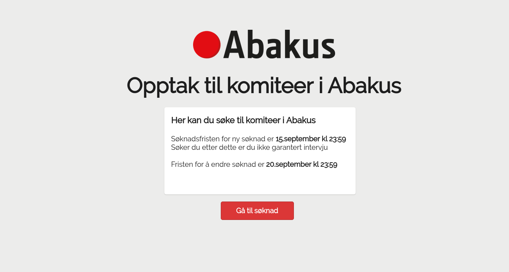
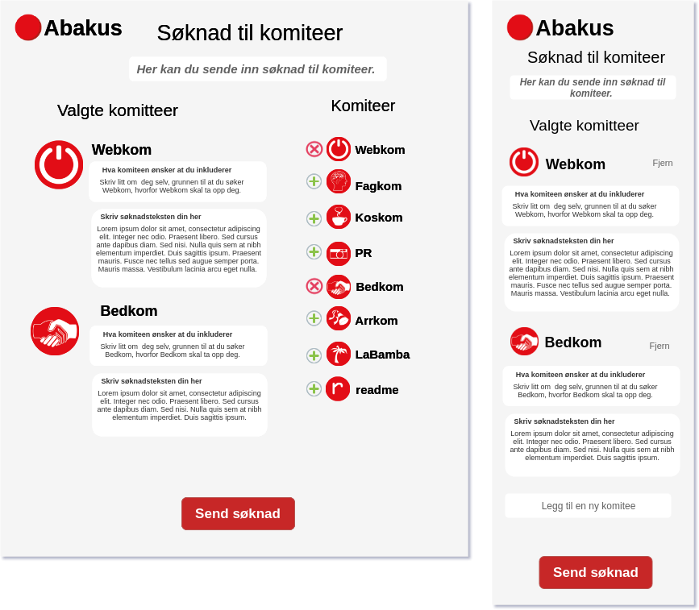

# committe-admissions-webapp

> Frontend for opptak.abakus.no

# Early mockups




## Getting Started

```bash
$ sudo apt-get update && sudo apt-get install yarn
$ yarn
$ yarn start
```

Everything should be up and running on [localhost:3000](http://localhost:3000).
