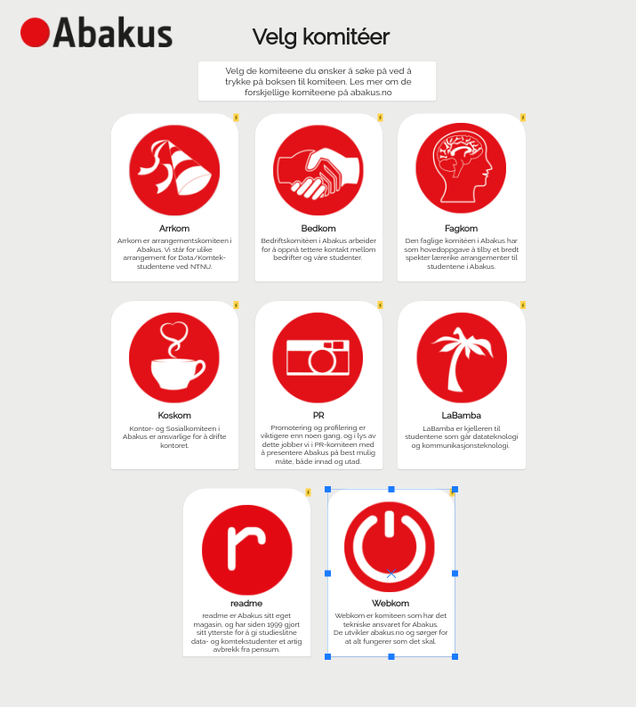

# committe-admissions-webapp

> Moved the frontend into the backend at https://github.com/webkom/committee-admissions so this is no longer updated.
> Frontend for opptak.abakus.no

## Early mockups




## Getting Started

```bash
$ sudo apt-get update && sudo apt-get install yarn
$ yarn
$ yarn start
```

Everything should be up and running on [localhost:3000](http://localhost:3000).
